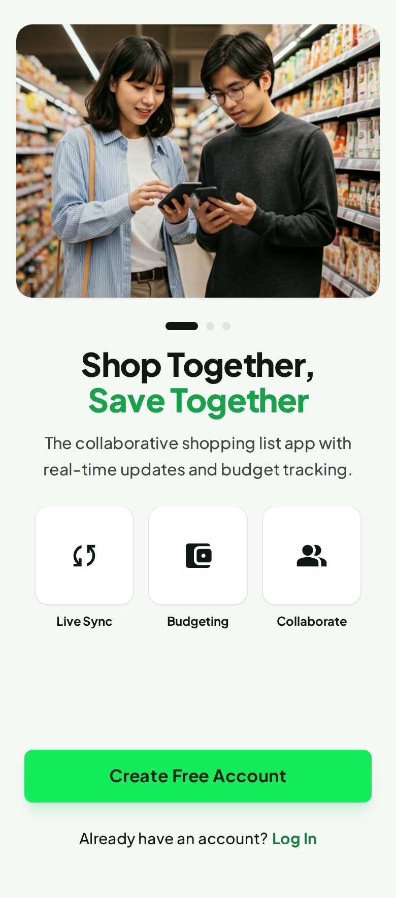
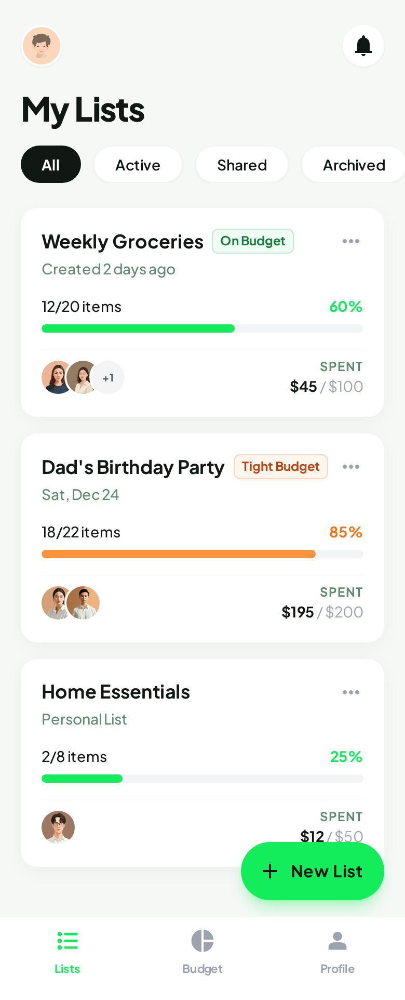
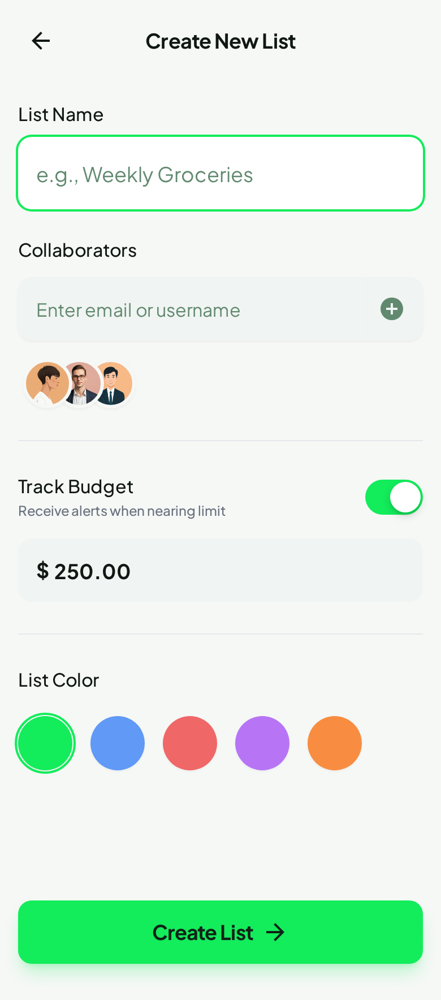
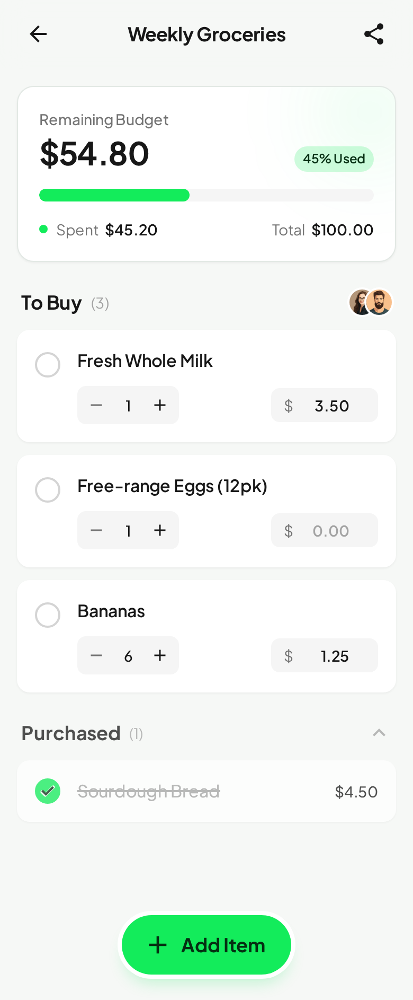
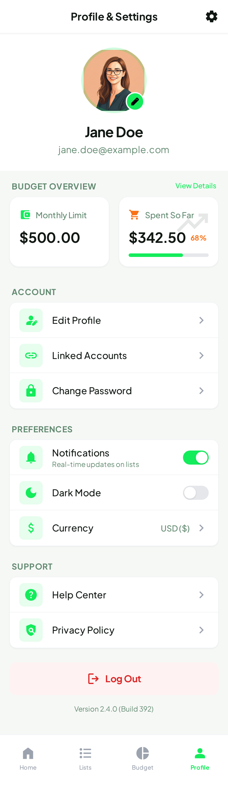

# Shopee - Smart Shopping List App

## Product Requirements Document (PRD)

### Table of Contents

1. [Overview](#overview)
2. [User Personas](#user-personas)
3. [Core Features](#core-features)
4. [UI/UX Design System](#uiux-design-system)
5. [Technical Architecture](#technical-architecture)
6. [Implementation Phases](#implementation-phases)
7. [Success Metrics](#success-metrics)

---

## Overview

### Product Vision

Shopee is a modern, intuitive mobile shopping list application designed to simplify grocery and shopping management. The app enables users to create, organize, and share shopping lists with a beautiful dark-themed interface.

### Target Platforms

- iOS (via Expo)
- Android (via Expo)
- Web (optional)

### Technology Stack

- **Framework**: Expo SDK 54 with React Native
- **Navigation**: Expo Router (file-based routing)
- **Styling**: NativeWind (TailwindCSS for React Native)
- **Backend**: Firebase (Authentication + Firestore)
- **State Management**: React Context API
- **Animations**: React Native Reanimated

---

## User Personas

### Primary User: Busy Professional

- **Age**: 25-45
- **Goals**: Quickly create and manage shopping lists, share with family
- **Pain Points**: Forgetting items, inefficient list organization, poor app UX

### Secondary User: Family Shopper

- **Age**: 30-50
- **Goals**: Coordinate shopping with household members
- **Pain Points**: Duplicate purchases, lack of collaboration

---

## Core Features

### 1. Onboarding & Welcome Screen



**Description**:

- Full-screen welcome experience with app branding
- Illustration of shopping concept
- Clear call-to-action buttons: "Sign Up" and "Log In"
- Tagline: "Manage your Shopping lists with ease"

**UI Elements**:

- App logo and name "Shopee"
- Decorative illustration (bag, shopping cart, items)
- Primary button: "Sign Up" (green filled)
- Secondary button: "Log In" (outlined)

---

### 2. Authentication - Sign Up


**Description**:

- Clean registration form with email/password
- Social authentication options (Google, Apple, Facebook)

**Form Fields**:

- Email address (with email icon)
- Password (with lock icon + visibility toggle)
- "I agree to Terms..." checkbox
- "Sign Up" button (full width, green)

**Additional Elements**:

- Back navigation arrow
- "Sign up" header title
- Social sign-up section with divider ("Or sign up with")
- Google, Apple, Facebook icons
- "Already have an account? Log in" link

---

### 3. Authentication - Login


**Description**:

- Similar layout to sign-up for consistency
- Forgot password functionality

**Form Fields**:

- Email address
- Password (with visibility toggle)
- Remember Me checkbox
- "Forgot password?" link
- "Log In" button

**Additional Elements**:

- Social login options (Google, Apple, Facebook)
- "Don't have an account? Sign Up" link

---

### 4. Shopping Lists (Home Screen)



**Description**:

- Main dashboard showing all shopping lists
- Search functionality
- Create new list button (FAB)

**UI Elements**:

- Header with "Shopping lists" title and notification bell
- Search bar with filter icon
- List of shopping list cards showing:
  - List icon (folder/document)
  - List name (e.g., "Home", "Work", "Personal")
  - Item count badge (e.g., "11 items")
  - Creation date
  - Chevron for navigation
- Floating Action Button (FAB) - "+" to create new list
- Bottom navigation bar

**List Card Design**:

- Dark card background with subtle border
- Green accent color for icons
- Clean typography hierarchy

---

### 5. Create New Shopping List



**Description**:

- Modal/screen for creating a new list
- Simple form with essential fields

**Form Fields**:

- List Name (text input with default "New Shopping List")
- Description (optional textarea)
- Icon selector (grid of icons)
- Color selector (palette of colors)

**Actions**:

- Cancel button (left)
- Create button (right, green)
- Header: "Create New List"

---

### 6. Shopping List Detail



**Description**:

- View and manage items within a list
- Check off items as completed
- Add new items

**UI Elements**:

- Back button and list title in header
- Edit/delete options (menu)
- List of items with:
  - Checkbox (circular, green when checked)
  - Item name
  - Quantity badge (optional)
  - Category tag (e.g., "Fruits", "Dairy")
- Completed items section (strikethrough text, muted colors)
- Add item input at bottom with "+" button
- "Add item" placeholder text

**Item States**:

- Unchecked: Full opacity, interactive
- Checked: Strikethrough, reduced opacity, moved to "Completed" section

---

### 7. Settings Screen



**Description**:

- User profile and app preferences
- Account management options

**Sections**:

**Profile Section**:

- User avatar (circular)
- User name
- Email address
- "Edit Profile" button

**Preferences**:

- Theme toggle (Light/Dark/System)
- Notifications toggle
- Language selector
- Default list settings

**Account**:

- Change Password
- Privacy Settings
- Linked Accounts

**Support**:

- Help Center
- Contact Us
- About App
- Rate App

**Danger Zone**:

- Log Out (red text)
- Delete Account (outlined red)

---

## UI/UX Design System

### Color Palette

```css
/* Primary Colors */
--primary-green: #22C55E       /* Main accent color */
--primary-green-light: #4ADE80 /* Hover states */
--primary-green-dark: #16A34A  /* Active states */

/* Background Colors */
--bg-primary: #0F0F0F          /* Main background */
--bg-secondary: #1A1A1A        /* Card backgrounds */
--bg-tertiary: #252525         /* Input backgrounds */

/* Text Colors */
--text-primary: #FFFFFF        /* Primary text */
--text-secondary: #A3A3A3      /* Secondary text */
--text-muted: #737373          /* Muted/disabled text */

/* Border Colors */
--border-default: #2E2E2E      /* Default borders */
--border-focus: #22C55E        /* Focus state borders */

/* Semantic Colors */
--danger: #EF4444              /* Delete/destructive actions */
--warning: #F59E0B             /* Warnings */
--success: #22C55E             /* Success states */
```

### Typography

```css
/* Font Family */
font-family: Inter, system-ui, sans-serif;

/* Font Sizes */
--text-xs: 12px;
--text-sm: 14px;
--text-base: 16px;
--text-lg: 18px;
--text-xl: 20px;
--text-2xl: 24px;
--text-3xl: 30px;

/* Font Weights */
--font-normal: 400;
--font-medium: 500;
--font-semibold: 600;
--font-bold: 700;
```

### Spacing & Sizing

```css
/* Spacing Scale */
--space-1: 4px;
--space-2: 8px;
--space-3: 12px;
--space-4: 16px;
--space-5: 20px;
--space-6: 24px;
--space-8: 32px;
--space-10: 40px;

/* Border Radius */
--radius-sm: 4px;
--radius-md: 8px;
--radius-lg: 12px;
--radius-xl: 16px;
--radius-full: 9999px;
```

### Component Standards

**Buttons**:

- Primary: Green background, white text, rounded-lg
- Secondary: Transparent background, green border, green text
- Danger: Red background or red text for destructive actions
- Icon buttons: 44x44px minimum touch target

**Inputs**:

- Dark background (#252525)
- Rounded-lg corners
- Left icon support
- Right action support (visibility toggle, clear)
- Focus state with green border

**Cards**:

- Dark secondary background
- Subtle border
- Rounded-lg corners
- Consistent padding (16px)

---

## Technical Architecture

### File Structure

```
shopee/
├── app/
│   ├── (auth)/                    # Auth flow routes
│   │   ├── _layout.tsx
│   │   ├── welcome.tsx
│   │   ├── login.tsx
│   │   └── signup.tsx
│   ├── (tabs)/                    # Main app tabs
│   │   ├── _layout.tsx
│   │   ├── index.tsx              # Shopping Lists
│   │   ├── create.tsx             # Create new list
│   │   └── settings.tsx           # Settings
│   ├── list/
│   │   └── [id].tsx               # List detail (dynamic)
│   └── _layout.tsx                # Root layout
├── components/
│   ├── ui/                        # Base UI components
│   │   ├── Button.tsx
│   │   ├── Input.tsx
│   │   ├── Card.tsx
│   │   ├── Checkbox.tsx
│   │   └── IconButton.tsx
│   ├── auth/                      # Auth-specific components
│   │   ├── SocialButtons.tsx
│   │   └── AuthForm.tsx
│   ├── lists/                     # List-specific components
│   │   ├── ListCard.tsx
│   │   ├── ListItem.tsx
│   │   └── AddItemInput.tsx
│   └── settings/                  # Settings components
│       ├── SettingsSection.tsx
│       └── SettingsItem.tsx
├── contexts/
│   ├── AuthContext.tsx
│   └── ListsContext.tsx
├── services/
│   ├── firebase.ts                # Firebase config
│   ├── auth.ts                    # Auth service
│   └── lists.ts                   # Lists CRUD service
├── hooks/
│   ├── useAuth.ts
│   └── useLists.ts
├── constants/
│   ├── theme.ts
│   └── icons.ts
├── types/
│   └── index.ts
└── utils/
    └── helpers.ts
```

### Firebase Data Model

```typescript
// Users Collection
interface User {
  id: string;
  email: string;
  displayName: string;
  photoURL?: string;
  createdAt: Timestamp;
  preferences: {
    theme: "light" | "dark" | "system";
    notifications: boolean;
    defaultListId?: string;
  };
}

// Shopping Lists Collection
interface ShoppingList {
  id: string;
  userId: string;
  name: string;
  description?: string;
  icon: string;
  color: string;
  itemCount: number;
  completedCount: number;
  createdAt: Timestamp;
  updatedAt: Timestamp;
}

// Items Sub-collection (under each list)
interface ListItem {
  id: string;
  name: string;
  quantity?: number;
  category?: string;
  isCompleted: boolean;
  createdAt: Timestamp;
  completedAt?: Timestamp;
}
```

---

## Implementation Phases

### Phase 1: Foundation & Design System (Week 1)

**Goal**: Establish the core design system and base components

**Tasks**:

1. ✅ Project setup (Expo, NativeWind, Firebase)
2. Update theme constants with new color palette
3. Create base UI components:
   - Button (primary, secondary, danger, icon variants)
   - Input (with icon support, visibility toggle)
   - Card component
   - Checkbox component
4. Configure Firebase (Auth + Firestore)
5. Set up global styles and utilities

**Deliverables**:

- Functional design system
- Component library foundation
- Firebase configuration

---

### Phase 2: Authentication Flow (Week 2)

**Goal**: Complete authentication system

**Tasks**:

1. Create Welcome screen
2. Create Sign Up screen with:
   - Form validation
   - Email/password registration
   - Social auth (Google, Apple, Facebook)
   - Terms checkbox
3. Create Login screen with:
   - Form validation
   - Remember me functionality
   - Forgot password flow
   - Social login
4. Implement AuthContext for state management
5. Set up protected routes

**Deliverables**:

- Full auth flow
- User session management
- Auth state persistence

---

### Phase 3: Shopping Lists Core (Week 3)

**Goal**: Main lists dashboard and CRUD operations

**Tasks**:

1. Create Shopping Lists home screen:
   - List display with cards
   - Search functionality
   - Filter options
2. Implement Create New List modal/screen:
   - Form with name, description
   - Icon picker
   - Color picker
3. Build ListsContext for state management
4. Firebase CRUD operations for lists
5. Real-time sync with Firestore

**Deliverables**:

- Lists dashboard
- Create/Read/Update/Delete functionality
- Real-time data sync

---

### Phase 4: List Items Management (Week 4)

**Goal**: Individual list view and item management

**Tasks**:

1. Create List Detail screen:
   - Item display with checkboxes
   - Completed items section
   - Category grouping
2. Add Item functionality:
   - Quick add input
   - Quantity support
   - Category assignment
3. Item interactions:
   - Check/uncheck items
   - Edit item
   - Delete item
   - Reorder items
4. Swipe gestures for quick actions

**Deliverables**:

- Complete list detail view
- Full item CRUD
- Gesture support

---

### Phase 5: Settings & Profile (Week 5)

**Goal**: User settings and preferences

**Tasks**:

1. Create Settings screen:
   - Profile section
   - Preferences section
   - Account section
   - Support section
2. Implement theme switching
3. Notification preferences
4. Profile editing
5. Account management (password change, delete)

**Deliverables**:

- Complete settings UI
- Working preferences
- Profile management

---

### Phase 6: Polish & Optimization (Week 6)

**Goal**: Final polish and performance

**Tasks**:

1. Add micro-animations and transitions
2. Loading states and skeletons
3. Error handling and empty states
4. Offline support with local caching
5. Performance optimization
6. Accessibility improvements
7. Testing and bug fixes

**Deliverables**:

- Production-ready app
- Smooth UX
- Offline capability

---

## Success Metrics

### User Experience

- App load time < 2 seconds
- Zero-delay item checking
- Smooth 60fps animations

### Functionality

- 100% feature parity with designs
- Real-time sync across devices
- Offline mode support

### Code Quality

- TypeScript strict mode
- Component reusability
- Clean architecture

---

## Appendix

### UI Reference Images

| Screen         | Reference                                     |
| -------------- | --------------------------------------------- |
| Welcome        | `context-images/welcome-screen.png`           |
| Sign Up        | `context-images/sign-up-screen.png`           |
| Login          | `context-images/login-screen.png`             |
| Shopping Lists | `context-images/shopping-list.png`            |
| Create List    | `context-images/create_new_shopping_list.png` |
| List Detail    | `context-images/shopping-list-detail.png`     |
| Settings       | `context-images/setting.png`                  |

### Dependencies to Add

```json
{
  "dependencies": {
    "@react-native-async-storage/async-storage": "for local persistence",
    "@react-native-google-signin/google-signin": "for Google auth",
    "expo-apple-authentication": "for Apple auth",
    "react-native-svg": "for icons",
    "@gorhom/bottom-sheet": "for modals"
  }
}
```
